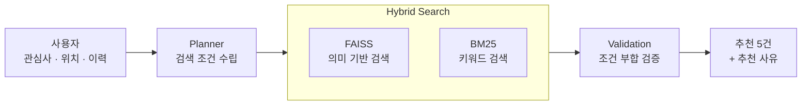
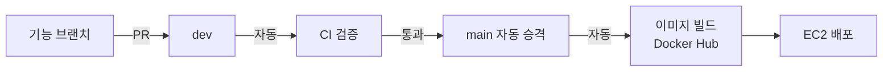

<div align="center">

# 🏆 퀘스트 지상주의

### 선행 퀘스트 (Good Deed Quest)

**작은 선행을 퀘스트로 — AI 기반 공익 플랫폼**

2026.06.26 ~ 2026.08.11

[](https://www.youtube.com/watch?v=8RYjzFgwSRk&t=167s)
[](https://lavish-lettuce-699.notion.site/abf10f046ae6833eb15e01bd6962af3c)
[](https://github.com/QuestismTeam/GoodDeedQuest)

</div>

---

## 🚀 왜 만들었나

선행을 하고 싶어 하는 사람은 많습니다. 그런데 실제 행동으로 잘 이어지지 않습니다.

- **뭘 해야 할지 모른다** — 무엇을, 어디서 할 수 있는지 알기 어렵다
- **정보가 흩어져 있다** — 1365, 지자체, 기관마다 따로 논다
- **계속할 이유가 없다** — 기존 플랫폼은 정보 제공에 그치고 동기부여가 없다
- **인증이 번거롭고 믿기 어렵다** — 실제로 했는지 검증할 방법이 마땅치 않다

그래서 **게임의 퀘스트·레벨·보상 구조**를 선행에 옮겼습니다.
AI 가 나에게 맞는 선행을 골라주고, 사진 한 장으로 인증하면 보상이 쌓이고,
그 기록이 숏폼 영상으로 남습니다.

---

## ✨ 주요 기능

<table>
<tr>
<td width="50%" valign="top">

### 🤖 AI 퀘스트 추천
관심사·위치·활동 이력을 읽어 매일 맞춤 퀘스트를 제안합니다.
**추천 이유까지 함께 제시**해서 왜 이걸 골랐는지 보여줍니다.

### 📷 Vision AI 인증
인증 사진을 올리면 AI 가 수행 여부를 판정합니다.
보류된 건은 주기 작업이 다시 판정합니다.

### 🎬 AI 숏폼 생성
인증 사진을 골라 **AI 자막**과 **BGM** 을 입힌 세로 영상을 만듭니다.
분위기에 맞는 배경음악을 30곡 중에서 자동으로 고릅니다.

</td>
<td width="50%" valign="top">

### 🗺️ 지도 퀘스트
전국 봉사 공고 **4,950건**을 위치 기반으로 탐색합니다.
지역 랭킹과 지역 대항전이 붙습니다.

### 👥 협동 챌린지 · 커뮤니티
팀 단위 퀘스트를 만들고 인증을 공유합니다.

### 🎮 성장 · 보상
난이도와 활동 강도로 계산한 포인트·경험치,
레벨, 배지, 상점에서 프로필 테두리 구매.

</td>
</tr>
</table>

---

## 🔍 추천은 이렇게 동작합니다

단순 키워드 검색도, 단순 벡터 검색도 아닙니다. **둘을 합쳤습니다.**



의미가 비슷한 공고는 **FAISS** 가, 단어가 정확히 맞는 공고는 **BM25** 가 잡아냅니다.
둘을 융합해서 "환경 봉사"로 검색했을 때 제목에 그 단어가 없는 **하천 정화 활동**도 걸리게 했습니다.

임베딩은 DB 에 캐시해 두고 재사용합니다. 4,950건 전체가 인덱싱되어 있습니다.

---

## 🛠 기술 스택

**Backend**


**AI**


**Frontend**


**Infra**


---

## 🏗 아키텍처

<div align="center">
  
</div>

앱은 **backend 하고만** 통신합니다. AI 서비스는 외부에 노출되지 않고,
같은 EC2 안에서 backend 가 내부 네트워크로만 호출합니다.

`backend` 와 `ai` 가 서로를 임포트하는 구조라 **하나의 이미지에 두 패키지를 담고
실행 명령만 다르게** 주는 방식을 택했습니다.
Celery 앱이 배지·인증용과 숏폼용 둘로 나뉘어 있어 워커도 둘로 띄웁니다.

인증 사진과 숏폼 영상은 S3 에, 나머지 데이터는 RDS 에 저장합니다.
EC2 는 액세스 키 없이 **IAM Role** 로 S3 에 접근합니다.

---

## 🔄 CI / CD

`dev` 에 머지하면 배포까지 사람 손 없이 진행됩니다.



CI 는 **컨테이너 전체를 실제로 띄워서** 검증합니다.

```
전체 스택 기동 → backend · ai 응답 확인 → 마이그레이션
→ 시드 적재 → Celery 워커 2종 등록 확인 → 테스트
```

하나라도 실패하면 `main` 승격조차 하지 않습니다. 깨진 코드가 서버에 올라갈 수 없습니다.

---

## 👥 팀원

| | 이름 | GitHub | 담당 |
| :---: | :---: | :---: | --- |
| 👑 | **최홍묵** | [@LeoChoi224](https://github.com/LeoChoi224) | 퀘스트 추천 로직 · 상점 & 포인트 · 배포 인프라 |
| | **문태현** | [@Moontaehyeon01](https://github.com/Moontaehyeon01) | AI 숏폼 생성 · 마이 페이지 |
| | **양정운** | [@yangjungun05-prog](https://github.com/yangjungun05-prog) | 퀘스트 인증 로직 · 인증 & 회원 기능 |
| | **이민재** | [@alswo0548](https://github.com/alswo0548) | 커뮤니티 · 팀 추천 · 관리자 대시보드 |
| | **정희준** | [@hjj1911](https://github.com/hjj1911) | 지도 퀘스트 · 레벨 & 성장 |

---

<div align="center">
<sub>KoreaITAcademy · LangChain을 활용한 AI 영상객체탐지분석 플랫폼 구축 과정 중간 프로젝트</sub>
</div>
